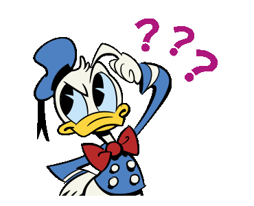

#  Secret Word


<p align="center">
  
  
  
  
  
  
  
</p>

> Status do Projeto: :white_check_mark: (concluido) | :warning: (em desenvolvimento) | :x: (não iniciada)

### Tópicos
:small_blue_diamond: [Descrição do Projeto](#writing_hand-descrição-do-projeto) :white_check_mark:

:small_blue_diamond: [Objetivo](#dart-objetivo) :white_check_mark:

:small_blue_diamond: [Funcionalidades](#video_game-funcionalidades) :white_check_mark:

:small_blue_diamond: [Instalação das Dependências](#arrow_down-instalação-das-dependências) :white_check_mark:

:small_blue_diamond: [Executar](#arrow_forward-executar) :white_check_mark:

:small_blue_diamond: [Captura de Tela](#camera_flash-captura-de-tela) :white_check_mark:

:small_blue_diamond: [Tecnologias Utilizadas](#hammer_and_wrench-tecnologias-utilizadas) :white_check_mark:


## :writing_hand: Descrição do Projeto 
<p align="justify"> Este site, desenvolvido com React JS, é um jogo interativo inspirado no programa "Roda a Roda" do SBT. No jogo, o usuário recebe uma dica relacionada a uma palavra específica e deve tentar adivinhar a palavra correta, letra por letra. </p>

## :dart: Objetivo 
<p align="justify"> O objetivo principal deste projeto é proporcionar uma experiência de jogo divertida e desafiadora, onde os usuários possam testar suas habilidades de dedução e conhecimento de palavras a partir de dicas fornecidas. </p>

## :video_game: Funcionalidades 
- Receber Dicas: O jogo fornece uma dica para ajudar o usuário a adivinhar a palavra correta;
- Adivinhação: O usuário tenta adivinhar a palavra inserindo letras uma a uma;
- Limite de Erros: O usuário pode errar até 5 vezes; após isso, o jogo termina;
- Interatividade: O site oferece uma interface amigável e interativa, onde o progresso do jogo é atualizado em tempo real.

## :arrow_down: Instalação das Dependências
- Entrar na pasta 'SecretWord':
``` bash
npm install
```

## :arrow_forward: Executar
``` bash
npm start
```

## :camera_flash: Captura de Tela 
<div> 
  
  
</div>

## :hammer_and_wrench: Tecnologias Utilizadas 
- ReactJS;
- HTML5;
- CSS3;
- JavaScript.

## Licença
The [MIT License]() (MIT)

Copyright :copyright: 2023 - Tiago Tomé
